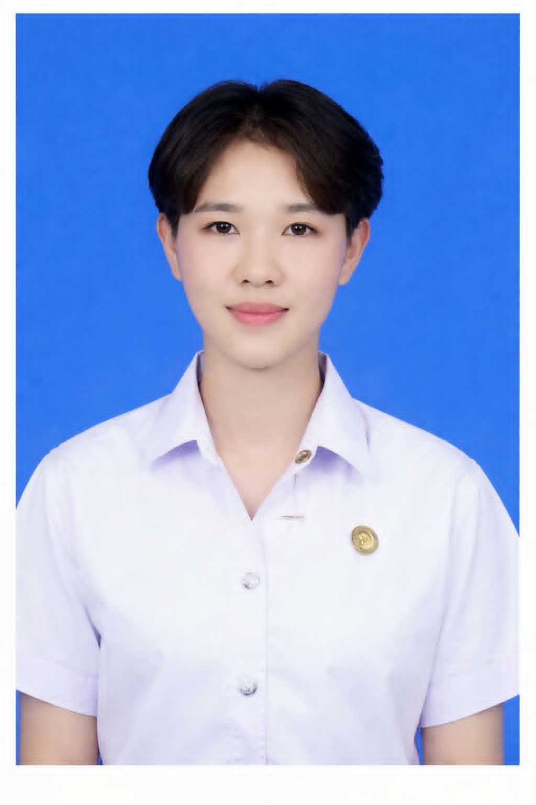

# 💙✨ RESUME | ประวัติส่วนตัว ✨💙

    

  

---

# 👤 ข้อมูลส่วนตัว

| 📝 รายละเอียด | 📌 ข้อมูล |
|:---|:---|
| 👩 ชื่อ | **นางสาว วรดา แก่นนาคำ** |
| 🌸 ชื่อเล่น | เพียว |
| 🎂 วันเกิด | 22 มกราคม 2547 |
| 🎈 อายุ | 22 ปี |
| 🌏 สัญชาติ | ไทย |

---

# 📞 ข้อมูลการติดต่อ

📱 **064-892-0666**

📧 **worada.gaennakam1122@gmail.com**

📍 **88/11 ต.พรมสวรรค์ อ.โพนทอง จ.ร้อยเอ็ด**

---

# 🎓 ประวัติการศึกษา

🏫 โรงเรียนโพนทองพัฒนาวิทยา

💻 มหาวิทยาลัยราชภัฏร้อยเอ็ด

📚 สาขาวิทยาการคอมพิวเตอร์

📊 GPAX **2.57**

---

# 💼 ประสบการณ์

🛒 พนักงานร้าน CJ MORE

✅ แคชเชียร์

✅ จัดเรียงสินค้า

✅ เช็กสต๊อกสินค้า

✅ บริการลูกค้า

---

# 💻 ทักษะ

🖥 HTML

🎨 CSS

🐍 Python

☕ Java

🗄 MySQL

🍃 MongoDB

---

# 🌟 คุณสมบัติ

🤝 ทำงานเป็นทีมได้

⏰ ตรงต่อเวลา

💡 เรียนรู้สิ่งใหม่ได้เร็ว

🔥 มีความรับผิดชอบ

💖 ซื่อสัตย์ อดทน

😊 มนุษยสัมพันธ์ดี

---

---

# 🌐 Social

---

### 🌸 ขอบคุณที่เข้ามาเยี่ยมชม 🌸

